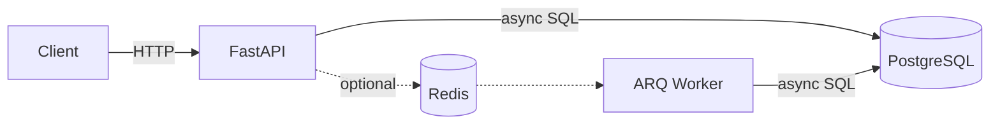
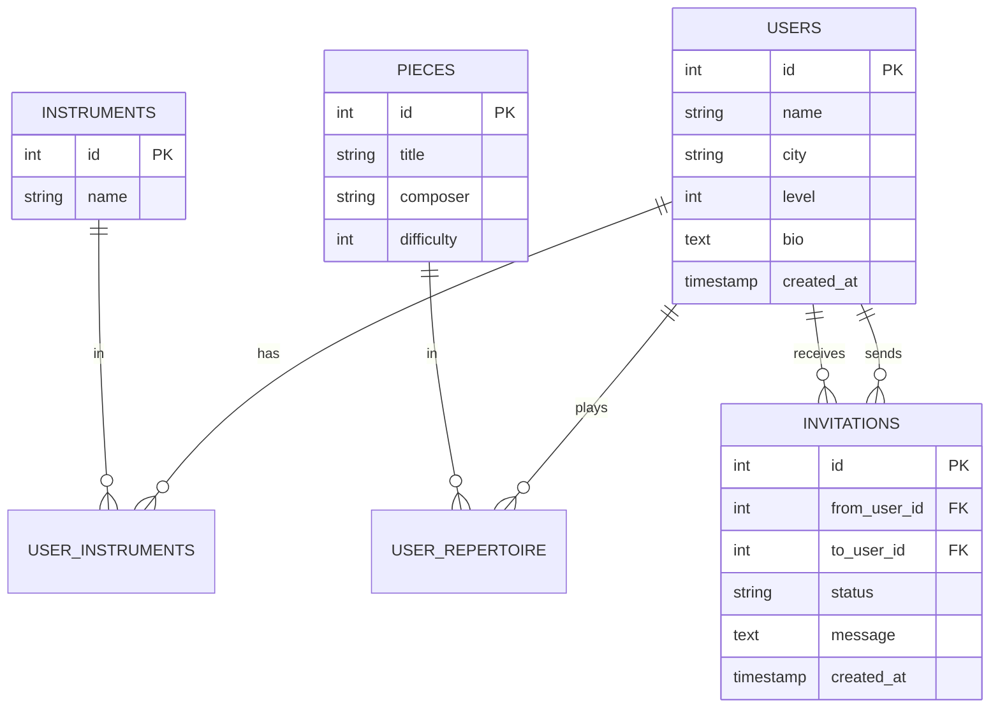

# ensemble-finder
Backend service for matching musicians by instrument, skill level, and shared repertoire. FastAPI + PostgreSQL + Docker.

# 🎻 Ensemble Finder

Сервис для поиска партнёров по совместной игре на музыкальных инструментах.

## 🎯 Зачем

У музыканта круг партнёров по ансамблю почти всегда ограничен средой, в которой он учится или работает: консерватория, школа, оркестр, круг друзей. Найти человека **вне этого пузыря** — со схожим уровнем, подходящим инструментом и общим репертуаром — сложно и почти негде.

Ensemble Finder решает эту задачу, подбирая партнёров по трём характеристикам:

- 🎼 **инструмент** — важно, чтобы тембры сочетались (скрипка + фортепиано ≠ скрипка + скрипка);
- 📈 **уровень** — разрыв в 2+ балла делает совместную игру некомфортной для обоих;
- 📚 **общий репертуар** — то, что реально можно сыграть вместе уже на первой встрече.

## 🏗️ Архитектура

### Общая схема

Приложение построено как классический **backend-only сервис с асинхронным API**. Клиент общается с FastAPI по HTTP, вся работа с БД — через async-драйвер `asyncpg`. Опциональный Redis + воркер добавлены для асинхронной обработки уведомлений о заявках.

### Компоненты

- **API** — HTTP-слой, валидация через Pydantic.
- **Services** — матчинг, изолирован от HTTP и ORM.
- **PostgreSQL** — источник правды, async-драйвер `asyncpg`.
- **Redis + ARQ** — опционально, для фоновых уведомлений о заявках.

### Модель данных

### Ключевые решения

- **Матчинг — чистая функция без ORM.** Тестируется без БД, формулу легко заменить.
- **Прозрачная формула вместо ML.** Возвращаем `reason` и `common_pieces` — пользователь видит, почему ему предложили именно этого человека.
- **Веса в конфиге.** Крутить можно без деплоя.

### Что осознанно за скоупом MVP

- **Аудиоанализ и парсинг MIDI** — не влияет на матчинг по репертуару.
- **WebSocket-чат** — отдельный слой, в roadmap.
- **ML-рекомендации** — нет достаточно данных, прозрачные веса дают лучший UX на старте.
